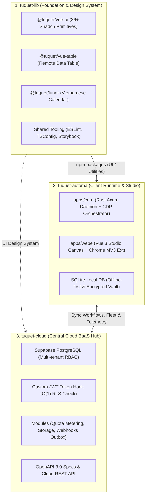

# 🗺️ Omniverse Ecosystem Master Roadmap

> **Hệ sinh thái:** Tuquet / Omni Creator  
> **Các repository nòng cốt:** `tuquet-lib` | `tuquet-automa` | `tuquet-cloud` | `tuquet-scoop-bucket`  
> **Mục tiêu:** Xây dựng nền tảng tự động hóa trình duyệt hiệu năng cao (Automation Engine), thư viện UI/Core dùng chung (Design System), và trung tâm điều phối đám mây đa tổ chức (Cloud Multi-Tenant SaaS BaaS Hub).

---

## 🏛️ 1. Bản Đồ Phân Tầng Kiến Trúc

---

## 📅 2. Tổng Quan Lộ Trình 3 Giai Đoạn

| Giai Đoạn       | Tên Giai Đoạn                                | Trọng Tâm                                                                                                            |        Trạng Thái         |
| :-------------- | :------------------------------------------- | :------------------------------------------------------------------------------------------------------------------- | :-----------------------: |
| **Giai đoạn 1** | **Core Base & Foundation Hardening**         | Chuẩn hóa toàn bộ nền móng: UI Primitives, Remote Table, Rust Engine Core, Schema RBAC trên Supabase, Proxy hạ tầng. | 🔥 **TRỌNG TÂM HIỆN TẠI** |
| **Giai đoạn 2** | **Cloud Integration & SaaS Sync**            | Kết nối `automa` lên `tuquet-cloud` qua Supabase Adapter; ra mắt Web Dashboard quản trị SaaS; mở rộng components.    |     ⏳ Sắp thực hiện      |
| **Giai đoạn 3** | **AI Agentic Automation & Distributed Grid** | AI Vision Autonomous Agent, CDP Selector tự phục hồi; điều phối hạm đội bot phân tán; thanh toán theo mức sử dụng.   |       🔮 Tương lai        |

---

## 🎯 3. CHI TIẾT GIAI ĐOẠN 1: CORE BASE & FOUNDATION (TRỌNG TÂM)

> **Mục tiêu then chốt:** Hoàn thiện 100% "những viên gạch nền móng" không tì vết trước khi xây dựng tầng tính năng đám mây và AI. Đảm bảo mọi bài test vượt qua, build sạch sẽ, bảo mật chặt chẽ và nhất quán xuyên suốt các repo.

### 📦 Workstream 1.1: `tuquet-lib` (Thư Viện Dùng Chung & Design System)

_Trách nhiệm: Đảm bảo độ tin cậy tuyệt đối, zero styling debt, và tính tái sử dụng cao._

- [x] **Monorepo Architecture:** Cấu hình Turborepo + pnpm workspace, `tsup` Dual ESM/CJS build pipeline, `publint` kiểm định exports.
- [x] **`@tuquet/vue-ui`:**
  - [x] Tích hợp 36+ components chuẩn Shadcn-Vue trên Reka UI & Tailwind CSS.
  - [x] Tích hợp Sonner Toaster và Design Tokens hỗ trợ đa giao diện (`tokens.css`).
  - [x] Thiết lập quy chuẩn bất biến: Không can thiệp sửa trực tiếp style gốc của vue-ui, duy trì đồng bộ 1:1 với upstream registry.
- [x] **`@tuquet/vue-table`:**
  - [x] Tích hợp TanStack Table v8, Virtual Scroll, URL Sync, AbortController.
  - [x] Hỗ trợ xuất dữ liệu đa định dạng: XLSX, CSV, TSV.
  - [x] Bộ kiểm thử 138/138 tests passed (21 test files).
- [x] **`@tuquet/lunar`:** Thuật toán thiên văn Lịch Âm - Dương, Can Chi, 24 Tiết Khí (17/17 tests passed).
- [x] **Showcase & CI/CD:** Storybook online (`storybook.flowup.io.vn`), Changesets release tự động lên npm registry qua GitHub Actions.
- [ ] **[Next Tasks - Hardening]**:
  - [ ] Kiểm thử độ tương thích giao diện trên màn hình nhỏ và hỗ trợ phím tắt điều hướng bảng.
  - [ ] Bổ sung Storybook stories cho toàn bộ các trường hợp biên của Dynamic Filters.

---

### ⚡ Workstream 1.2: `tuquet-automa` (Động Cơ Thực Thi Cục Bộ & Studio)

_Trách nhiệm: Cỗ máy thực thi tại máy trạm ổn định, hiệu năng cao, cách ly trình duyệt triệt để._

- [x] **Kiến Trúc & SRS:**
  - [x] Bản đồ tư duy 7 nguyên tắc bất biến (7 Golden Invariants).
  - [x] Hệ thống đặc tả Ma trận 2 chiều (`docs/srs/`): Horizontal Standards (Buttons, Selects, Stores, UI) & Vertical Menus (Studio, Browsers, Campaign, Storage, History, Settings).
- [x] **Lưu Trữ Cục Bộ & Két Sắt Mã Hóa:**
  - [x] SQLite database-first: Quản lý tập trung mọi thực thể, loại bỏ anti-pattern quét file JSON.
  - [x] Két sắt mật mã: `HMAC-SHA256 + AES-256-CBC`, giải mã RAM-only trong microsecond thực thi, zero leak ra đĩa/log.
- [x] **Quản Trị Trình Duyệt (Chromium Isolation):**
  - [x] Tải và quản lý binary Chromium độc lập theo kiến trúc Playwright (không quét hay chiếm quyền trình duyệt cá nhân của máy).
- [x] **Phân Phối Ứng Dụng:** Đóng gói Scoop bucket (`automa.json`) và pre-built binary GitHub Releases.
- [x] **Rust Core Toolchain:** Cấu hình và kích hoạt thành công toolchain GNU (`stable-x86_64-pc-windows-gnu`) cùng Scoop MinGW GCC và proxy SOCKS5, `cargo check` biên dịch thành công 100% `apps/core` (Finished dev profile in 2m 18s).
- [ ] **[Next Tasks - Core Base Focus]**:
  - [ ] **Local Daemon End-to-End Test:** Chạy kiểm thử tương tác thực tế giữa Axum Daemon (`127.0.0.1:8765`), Scalar API Server (`:8767`), và Web Studio Canvas (`apps/webe`).
  - [ ] **Shadcn Consumption Alignment:** Đảm bảo `apps/webe` tiêu thụ trực tiếp các linh kiện từ `@tuquet/vue-ui` và `@tuquet/vue-table` thay vì định nghĩa trùng lặp.

---

### ☁️ Workstream 1.3: `tuquet-cloud` (Nền Tảng Multi-Tenant RBAC Cloud & BaaS Hub)

_Trách nhiệm: Quản trị bảo mật phân quyền đa tổ chức, mô hình hóa dữ liệu chuẩn hóa trên Supabase (trước đây là `tuquet-creator`)._

- [x] **Định Danh Chuẩn Hóa:** Đổi tên repository và định vị chuẩn xác thành `tuquet-cloud` — đóng vai trò là Central Cloud BaaS Hub của toàn bộ hệ sinh thái.
- [x] **Schema Thiết Kế Multi-Tenant RBAC:**
  - [x] Hoàn thiện schema PostgreSQL (`tenants`, `profiles`, `roles`, `permissions`, `member_roles`, `tenant_invitations`, `audit_logs`, `projects`).
  - [x] Phân biệt rõ ràng System Role (`tenant_id IS NULL`) và Custom Tenant Role (`tenant_id = UUID`).
- [x] **Bảo Mật & Hiệu Năng RLS:**
  - [x] Ngăn chặn triệt để RLS Infinite Recursion bằng các hàm `SECURITY DEFINER` (`is_tenant_member`, `has_tenant_permission`, `is_tenant_admin`).
  - [x] Tích hợp Supabase Custom Access Token (JWT) Hook nhúng `tenant_id` và roles vào Claims để kiểm tra quyền với độ phức tạp $O(1)$.
  - [x] Đánh Composite Index bắt đầu bằng `tenant_id` trên mọi bảng nghiệp vụ nhằm triệt tiêu nguy cơ rò rỉ chéo dữ liệu và sẵn sàng cho Table Partitioning.
- [x] **Module Mở Rộng SQL (Plug & Play):**
  - [x] `01_media_storage_assets.sql`: Quản lý tài nguyên media & RLS Storage phân lập.
  - [x] `02_subscriptions_entitlements.sql`: Gói cước và tự động chặn vượt Quota `projects`.
  - [x] `03_outbox_webhooks_queue.sql`: Hàng đợi sự kiện bất đồng bộ và Webhook dispatch.
  - [x] `04_soft_delete_pattern.sql`: Cơ chế xóa mềm (`deleted_at`) và phục hồi dữ liệu.
- [x] **OpenAPI Specification:** Xuất file OpenAPI 3.0.3 JSON chuẩn (`docs/openapi_spec_rbac.json`).
- [ ] **[Next Tasks - Core Base Focus]**:
  - [ ] Chạy kiểm thử tự động toàn bộ SQL Migration trên local Supabase Docker instance (`supabase start` && `supabase db reset`).
  - [ ] Tạo script tự động sinh TypeScript Client SDK từ `openapi_spec_rbac.json` để chia sẻ cho các client tiêu thụ.

---

### 🌐 Workstream 1.4: Hạ Tầng Mạng, Proxy & Dev Tooling

_Trách nhiệm: Đảm bảo môi trường làm việc thông suốt trong mọi điều kiện mạng bị chặn/tường lửa._

- [x] **Bộ Scripts Mạng Chuẩn Hóa (`scripts/network/`):**
  - [x] `configure_git_proxy.ps1`: Cấu hình repo local dùng proxy SOCKS5 (`127.0.0.1:1080`).
  - [x] `ensure_proxy.ps1` & `ensure_proxy.bat`: Tự phục hồi Cloudflare Tunnel (`2222`) và SSH SOCKS5 (`1080`).
  - [x] `stop_proxy.ps1` & `test_network.ps1`: Giải phóng cổng và chẩn đoán trạng thái kết nối.
  - [x] Áp dụng nhất quán 100% trên `tuquet-lib`, `tuquet-automa`, `tuquet-cloud`, `scoop-bucket`, và `lotte-ecosystem`.
- [x] **Chuẩn Hóa VS Code Workspace:**
  - [x] Cấu hình `"search.useIgnoreFiles": false` và danh sách loại trừ artifact trong `.vscode/settings.json`.
  - [x] Tích hợp 5 tác vụ Network & Git Proxy tiêu chuẩn trong `.vscode/tasks.json`.

---

## 🚀 4. Kế Hoạch Giai Đoạn 2 (Cloud Integration & SaaS Sync)

1. **Supabase Remote Adapter trên `tuquet-automa`:**
   - Xây dựng tầng kết nối đám mây song song với SQLite cục bộ.
   - Hỗ trợ người dùng đồng bộ workflows, campaign templates, và lịch sử thực thi lên tài khoản Creator trên mây `tuquet-cloud`.
2. **Web Dashboard Quản Trị SaaS (`tuquet-creator` app):**
   - Xây dựng giao diện web cho Creator quản lý tổ chức, phân quyền thành viên, cấp phát khóa kích hoạt bot và giám sát quota thông qua `tuquet-cloud`.
3. **Mở Rộng UI Components trên `tuquet-lib`:**
   - Bổ sung Analytics Charts, Agent Flow Node components, và Command Palette (`Cmd+K`).

---

## 🔮 5. Kế Hoạch Giai Đoạn 3 (AI Agent & Distributed Grid)

1. **AI Vision & Self-Healing Automation (`tuquet-automa`):**
   - Tích hợp mô hình AI đa phương thức để tự phục hồi Selector khi giao diện mục tiêu thay đổi.
   - Giải quyết tự động các bài toán tương tác phức tạp (CAPTCHA, OTP, dynamic multi-step canvas).
2. **Distributed Runner Grid (`tuquet-cloud`):**
   - Quản trị hạm đội hàng trăm bot runner `automa` phân tán trên toàn cầu thông qua WebSocket/Supabase Realtime.
   - Tích hợp cổng thanh toán SaaS (Stripe/MoMo) và tính cước theo mức sử dụng thực tế (Pay-as-you-go).
3. **Headless Cross-Platform UI (`tuquet-lib`):**
   - Đóng gói ứng dụng máy trạm Desktop (Tauri) và Web Extension đa trình duyệt với độ bao phủ test $\ge 90\%$.

---

## 📜 6. Quy Tắc Bất Biến Khi Phát Triển (Development Invariants)

1. **Strict ASCII Invariance:** Toàn bộ script PowerShell, biến môi trường, và file cấu hình CLI chỉ sử dụng ký tự ASCII để tương thích an toàn tuyệt đối với Windows PowerShell 5.1.
2. **Scoop-First Tooling:** Quản lý môi trường và công cụ (`nodejs`, `pnpm`, `rustup`, `supabase`, `mingw`) ưu tiên hàng đầu qua Scoop.
3. **No Direct UI Style Mutation:** Không chỉnh sửa trực tiếp style của component nguyên tử trong `@tuquet/vue-ui`. Mọi tùy biến giao diện phải xử lý qua Design Tokens (`tokens.css`).
4. **Zero-Leak Credentials:** Mọi khóa bí mật, token, passkey chỉ giải mã trên bộ nhớ RAM trong thời gian thực thi, không bao giờ ghi xuống đĩa hoặc in ra log.
