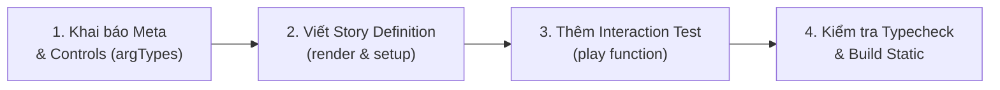

# Hướng dẫn Phát triển Component với Storybook (tuquet-lib)

Tài liệu này cung cấp toàn bộ quy chuẩn, workflow và giải pháp kỹ thuật đã được kiểm chứng để phát triển, tài liệu hóa và kiểm thử tự động các Vue 3 components với Storybook 8+ trong monorepo `@tuquet`.

---

## 1. 🎯 Nguyên tắc Cốt lõi & Kiến trúc Monorepo

1. **Co-location Story Files**:
   - Tất cả các file Storybook được đặt ngay cạnh component mà nó đại diện:
     - Component bảng & filters: `packages/vue-table/src/components/*.stories.ts`
     - Component UI primitives: `packages/vue-ui/src/components/ui/**/*.stories.ts`
   - Storybook server tập trung chạy tại `apps/storybook` (Port 6006 / 6007).

2. **Tuân thủ chuẩn CSF3 (Component Story Format v3)**:
   - Sử dụng định nghĩa kiểu an toàn `Meta<typeof Component>` và `StoryObj<typeof meta>`.
   - Cung cấp đầy đủ `argTypes` controls để người dùng có thể tùy biến mọi props trực tiếp trên giao diện.

3. **Master Story cho Composite Components**:
   - Thay vì tạo quá nhiều story vụn vặt gây khó theo dõi, hãy ưu tiên xây dựng **1 Master Story tổng hợp toàn diện** (như `AllInOneEnterpriseTable`), phản ánh đúng nghiệp vụ thực tế (Remote fetch, Virtual scroll, Column pinning, Density toggle, Bulk actions, Export và Inline cell editing).

---

## 2. ⚡ Quy trình 4 Bước Phát triển Story Hoàn chỉnh



### Bước 1: Khai báo Meta & Controls đầy đủ

- Đặt `title` theo cấu trúc danh mục, ví dụ: `'Vue Table/DataTable'` hoặc `'Vue UI/RangeCalendar'`.
- Khai báo chi tiết `argTypes` cho mọi tham số có thể tương tác (boolean, select, range, inline-radio) kèm mô tả tiếng Việt và phân loại `table.category`.
- Xem chi tiết tại: [Hướng dẫn Controls & ArgTypes](./references/controls-and-args.md)

### Bước 2: Viết Story Definition với render function và setup

- Khai báo tất cả các components con cần thiết trong `components: { ... }`.
- Khởi tạo state, watchers (`watch(() => args.prop)`), methods trong `setup()`.
- Viết template HTML trực quan, gọn gàng.
- ⚠️ **QUY TẮC SỐNG CÒN**: **TUYỆT ĐỐI KHÔNG** dùng từ khóa `as` (ép kiểu TypeScript) bên trong chuỗi template HTML. Mọi type casting phải thực hiện trong `setup()`.
- Xem chi tiết tại: [Chuẩn mực CSF3 cho Vue 3](./references/csf3-vue-standards.md) và [Danh sách Lỗi Thường gặp](./references/common-pitfalls.md)

### Bước 3: Thêm kịch bản kiểm thử tương tác tự động (`play` function)

- Sử dụng thư viện `@storybook/test`: `step`, `within`, `userEvent`, `expect`.
- Chia kịch bản thành từng bước rõ ràng: Khởi tạo, gõ từ khóa tìm kiếm debounce, chọn checkbox, click dropdown, nhảy nhanh dòng, inline edit.
- Xem chi tiết tại: [Hướng dẫn Interaction Testing](./references/interaction-testing.md)

### Bước 4: Kiểm tra và Build

- Chạy typecheck monorepo: `pnpm typecheck`
- Chạy unit tests: `pnpm test`
- Kiểm tra syntax story: `node skills/storybook/scripts/validate-stories.mjs`
- Khởi động dev server: `pnpm storybook`

---

## 3. 📚 Thư viện Tài liệu Chuyên sâu (`references/`)

Đọc các tài liệu chuyên đề khi cần đi sâu vào từng tính năng kỹ thuật:

| Tài liệu                                                                | Nội dung chính                                                                         |
| :---------------------------------------------------------------------- | :------------------------------------------------------------------------------------- |
| 📖 [CSF3 Vue Standards](./references/csf3-vue-standards.md)             | Cấu trúc chuẩn TypeScript, render function, reactivity, dynamic mock data              |
| 🎛️ [Controls & ArgTypes](./references/controls-and-args.md)             | Cách cấu hình mọi loại controls: boolean, select, range, inline-radio, category        |
| 🧪 [Interaction Testing](./references/interaction-testing.md)           | Kỹ thuật viết play function với step, userEvent, expect mô phỏng người dùng            |
| 🎨 [Layout & Styling](./references/layout-and-styling.md)               | Cố định layout fixed, Column pinning, Density không vỡ ô, Group hover, Inline edit     |
| 🚀 [Enterprise Table Stories](./references/enterprise-table-stories.md) | Mẫu story cho Table API Facade, Saved Views, Mobile Card View, Plugins và Dynamic Form |
| ⚠️ [Common Pitfalls](./references/common-pitfalls.md)                   | Tổng hợp các lỗi runtime thường gặp (như `as` trong template) và cách xử lý            |

---

## 4. 📋 Bộ Templates Mẫu Sẵn dùng (`templates/`)

Copy trực tiếp các mẫu story chuẩn để tiết kiệm thời gian:

- [simple-component.story.ts](./templates/simple-component.story.ts): Dành cho component đơn (Button, Badge, Input, Card).
- [data-grid.story.ts](./templates/data-grid.story.ts): Dành cho bảng dữ liệu phức hợp (Virtual scrolling, Pinning, Density, Inline edit).
- [form-controls.story.ts](./templates/form-controls.story.ts): Dành cho component nhập liệu / lựa chọn nâng cao (RemoteCombobox, DateRange).

---

## 5. 🛠️ Lệnh thường dùng & Automation Scripts

- Kiểm tra cú pháp toàn bộ stories:
  ```bash
  node skills/storybook/scripts/validate-stories.mjs
  ```
- Khởi động Storybook dev server:
  ```bash
  pnpm storybook
  ```
- Build Storybook static production:
  ```bash
  pnpm build:storybook
  ```
- Xem trước bản build tĩnh:
  ```bash
  pnpm preview:storybook
  ```
